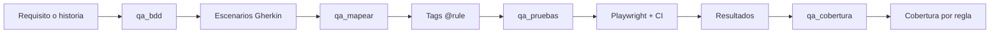

# AIQUAA Playwright MCP Server

> Convertí requisitos en pruebas Playwright BDD trazables, listas para CI y conectadas con las reglas de negocio que protegen.

[](https://www.npmjs.com/package/aiquaa-playwright-mcp-server)
[](https://github.com/stevenayal/aiquaa-playwright-mcp-server/actions/workflows/ci.yml)
[](https://nodejs.org/)
[](LICENSE)

**AIQUAA Playwright MCP Server** es un servidor [Model Context Protocol](https://modelcontextprotocol.io/) para equipos de QA que necesitan algo más que código generado: escenarios Gherkin, automatización Playwright, trazabilidad por regla, pipelines reproducibles y cobertura auditable.

[npm](https://www.npmjs.com/package/aiquaa-playwright-mcp-server) · [última release](https://github.com/stevenayal/aiquaa-playwright-mcp-server/releases/latest) · [reportar un problema](https://github.com/stevenayal/aiquaa-playwright-mcp-server/issues)

## De una historia a evidencia ejecutable



El resultado no es un test aislado. Es una cadena de evidencia:

- cada escenario puede declarar qué regla valida;
- cada ejecución conserva esa relación en el reporter;
- cada regla queda clasificada como `passed`, `failing`, `not_run` o `uncovered`;
- GitHub Actions y Azure Pipelines reciben artefactos listos para adaptar.

## Por qué usarlo

| Necesidad | Qué aporta AIQUAA |
|---|---|
| Pasar historias a BDD | Genera Gherkin revisable con flujos positivos, validaciones y errores |
| Evitar selectores inventados | Registra su procedencia y deja `TODO` explícitos cuando falta contexto real |
| Probar reglas, no solo pantallas | Propaga `@rule:<ID>` hasta resultados y cobertura |
| Llevarlo a CI | Genera configuración para GitHub Actions y Azure Pipelines |
| Manejar login y verificaciones externas | Usa `storageState`, secretos por entorno y polling para email, SMS, push o APIs |
| Reducir contexto repetido | Integra CodeGraph para código enfocado y Engram para memoria persistente |

## Quick start

### 1. Iniciá el servidor

```bash
npx -y aiquaa-playwright-mcp-server
```

El servidor queda disponible en:

- MCP: `http://localhost:3000/mcp`
- Health check: `http://localhost:3000/health`

`PORT` y `MCP_PATH` son configurables.

### 2. Conectá tu cliente MCP

Para clientes compatibles con Streamable HTTP, usá esta definición como referencia:

```json
{
  "mcpServers": {
    "aiquaa-qa": {
      "url": "http://localhost:3000/mcp"
    }
  }
}
```

La ubicación exacta del archivo cambia según el cliente. El servidor usa Streamable HTTP sin estado y crea un contexto aislado por solicitud.

### 3. Pedile un flujo completo

```text
Generá escenarios BDD para recuperación de contraseña, mapealos a
RN-014 y RN-015, y prepará los tests Playwright para GitHub Actions.
No ejecutes el navegador.
```

El agente puede encadenar `qa_bdd` → `qa_mapear` → `qa_pruebas` y devolverte archivos copiables.

## Las ocho tools

Los nombres son breves, en español y fáciles de descubrir:

| Tool | Resultado | Requiere backend AIQUAA |
|---|---|---|
| `qa_bdd` | Features Gherkin desde texto o `requirement_id` | Solo con IDs o sugerencia remota de reglas |
| `qa_pruebas` | Steps, hooks, reporter, configuración, auth y pipelines | Solo con `feature_id` |
| `qa_reglas` | Reglas paginadas con filtros | Sí |
| `qa_mapear` | Features etiquetados con `@rule:<ID>` | No |
| `qa_cobertura` | Cobertura y estado por regla/feature | Evitable con snapshot offline |
| `qa_contexto` | Contexto estructural enfocado mediante CodeGraph | No |
| `qa_memoria` | Decisiones y aprendizajes recuperados desde Engram | No |
| `qa_recordar` | Memoria curada e idempotente por `topic_key` | No |

Todos los inputs usan schemas Zod estrictos. Las tools declaran sus annotations MCP de lectura, escritura, idempotencia y acceso externo.

## Qué genera

Según las opciones seleccionadas, `qa_pruebas` puede devolver:

```text
features/
├── steps/*.steps.ts
└── support/
    ├── auth.setup.ts
    ├── external-validation.ts
    └── rule-hooks.ts
playwright.config.ts
.github/workflows/playwright.yml
azure-pipelines.playwright.yml
```

Además, el paquete exporta extensiones reutilizables:

```ts
import AiquaaRuleReporter from "aiquaa-playwright-mcp-server/rule-reporter";
import { ruleIdsFromTags } from "aiquaa-playwright-mcp-server/rule-tags";
```

El proyecto generado usa las APIs públicas de [`playwright-bdd`](https://github.com/vitalets/playwright-bdd) y Playwright. No modifica internals del runner.

## Ejemplo: feature a Playwright

Invocación de `qa_pruebas`:

```json
{
  "feature_content": "Feature: Login\nScenario: Acceso válido\nGiven el usuario está en login\nWhen hace clic en \"Ingresar\"\nThen ve \"Inicio\"",
  "base_url": "https://staging.example.com",
  "app_context": "El formulario usa labels Email y Contraseña.",
  "selector_source": "provided_component",
  "auth": {
    "login_path": "/login",
    "username_label": "Email",
    "password_label": "Contraseña",
    "submit_name": "Ingresar",
    "success_url_pattern": "dashboard",
    "username_env": "TEST_USER",
    "password_env": "TEST_PASSWORD"
  },
  "browsers": ["chromium"],
  "ci_targets": ["github_actions", "azure_pipelines"],
  "response_format": "json"
}
```

En el proyecto de pruebas:

```bash
npm install -D @playwright/test playwright-bdd aiquaa-playwright-mcp-server
npx bddgen
npx playwright test
```

El reporter escribe `test-results/aiquaa-rule-results.json`, compatible con `qa_cobertura`.

## Selectores que no venden humo

El generador distingue el origen real de cada locator:

- `provided_dom`: DOM renderizado inspeccionado;
- `provided_component`: componente React, Vue, Angular u otro código real;
- `provided_test_ids`: inventario confirmado de `data-testid`;
- `estimated`: inferido solo desde Gherkin.

Si falta información para implementar una acción o assertion confiable, genera un `TODO` que falla explícitamente. No produce falsos positivos comprobando únicamente que la página existe.

## Seguridad desde el diseño

- No incluye credenciales fallback en código generado.
- `auth.setup.ts` exige secretos y usa Playwright `storageState`.
- SMS, email, push y estados externos se consultan mediante variables de entorno.
- El Bearer token recibido por el MCP se usa únicamente para esa solicitud.
- CodeGraph solo puede leer rutas bajo `CODEGRAPH_ALLOWED_ROOTS`.
- Engram queda limitado a memoria con scope de proyecto.

> El passthrough de Bearer protege las llamadas a AIQUAA, pero no reemplaza la autenticación del propio endpoint MCP. Si lo exponés en Internet, protegelo con un gateway o reverse proxy.

## Uso offline y conectado

La mayoría del flujo funciona sin backend:

- `qa_bdd` acepta texto directo;
- `qa_pruebas` acepta Gherkin directo;
- `qa_mapear` es completamente local;
- `qa_cobertura` acepta un snapshot de reglas.

Para resolver IDs y consultar reglas configurá:

| Variable | Uso |
|---|---|
| `AIQUAA_API_BASE_URL` | URL del backend AIQUAA |
| `AIQUAA_ACCESS_TOKEN` | Bearer token de desarrollo; en producción preferí el header por solicitud |
| `PORT` | Puerto HTTP, default `3000` |
| `MCP_PATH` | Ruta MCP, default `/mcp` |

```powershell
$env:AIQUAA_API_BASE_URL="https://api.example.aiquaa.com"
$env:AIQUAA_ACCESS_TOKEN="<token-local>"
npx aiquaa-playwright-mcp-server
```

Las rutas actuales del cliente AIQUAA están centralizadas en `src/constants.ts` y deben confirmarse contra el OpenAPI real:

| Operación | Ruta asumida |
|---|---|
| Reglas | `GET /projects/:projectId/business-rules` |
| Requerimiento | `GET /projects/:projectId/requirements/:requirementId` |
| Feature | `GET /features/:featureId` |

## Contexto eficiente con CodeGraph

[CodeGraph](https://github.com/stevenayal/codegraph) construye contexto estructural enfocado antes de generar tests. Resulta especialmente útil cuando el servidor comparte filesystem con el repositorio bajo prueba.

```bash
npm install -g @colbymchenry/codegraph
cd /workspace/projects/checkout
codegraph init -i

export CODEGRAPH_BIN=codegraph
export CODEGRAPH_ALLOWED_ROOTS=/workspace/projects
```

Usá `qa_contexto` para localizar rutas, componentes, labels y test IDs; luego pasá el resultado como `app_context` a `qa_pruebas`. En Windows, separá múltiples raíces permitidas con `;`; en Linux/macOS, con `:`.

## Memoria persistente con Engram

[Engram](https://github.com/stevenayal/engram) conserva decisiones útiles entre sesiones sin convertir cada tool call en memoria.

```bash
export ENGRAM_BIN=engram
export ENGRAM_PROJECT_PREFIX=aiquaa-
```

- `qa_memoria` busca solo dentro del proyecto indicado.
- `qa_recordar` exige un `topic_key` estable para actualizar en vez de duplicar.

Formato recomendado:

```text
What: se eligió getByRole para acciones primarias.
Why: conserva semántica accesible y evita CSS frágil.
Where: features/steps/login.steps.ts.
Learned: data-testid queda para controles sin nombre accesible estable.
```

En contenedores, montá el directorio de datos de Engram como volumen persistente. No publiques su base como artifact: puede contener contexto sensible.

## CI/CD incluido

El repositorio valida cada cambio mediante `.github/workflows/ci.yml`. Para proyectos consumidores incluye:

- `examples/ci/github-actions-playwright.yml`
- `examples/ci/azure-pipelines-playwright.yml`

Ambos ejemplos ejecutan `bddgen`, corren Playwright, publican JUnit y conservan reportes como artifacts. Las releases npm se publican mediante Trusted Publishing/OIDC, sin tokens permanentes.

## Migración desde v0.1.x

La versión `0.2.0` redujo los nombres públicos para ahorrar contexto. Es un cambio incompatible intencional; no se duplican aliases.

| v0.1.x | v0.2.x |
|---|---|
| `aiquaa_generate_bdd_scenarios` | `qa_bdd` |
| `aiquaa_generate_playwright_tests` | `qa_pruebas` |
| `aiquaa_list_business_rules` | `qa_reglas` |
| `aiquaa_map_scenarios_to_rules` | `qa_mapear` |
| `aiquaa_generate_coverage_report` | `qa_cobertura` |
| `aiquaa_get_code_context` | `qa_contexto` |
| `aiquaa_search_project_memory` | `qa_memoria` |
| `aiquaa_save_project_memory` | `qa_recordar` |

## Alcance deliberado

Este MCP **genera** y conecta artefactos. No:

- abre navegadores ni ejecuta pruebas dentro del servidor;
- hace OCR de PDFs;
- adivina que un selector estimado fue validado;
- reemplaza la revisión humana del Gherkin generado;
- cuenta como `uncovered` una regla que no fue incluida en AIQUAA o en el snapshot.

Para PDFs, extraé primero el texto con una herramienta especializada y enviá `requirement_source: "extracted_from_pdf"`; el servidor aplica guardrails contra OCR evidentemente roto.

## Desarrollo

```bash
git clone https://github.com/stevenayal/aiquaa-playwright-mcp-server.git
cd aiquaa-playwright-mcp-server
npm ci
npm test
```

El proyecto usa TypeScript estricto, 9 pruebas automatizadas y 13 evaluaciones MCP. Los YAML generados y los ejemplos estáticos se validan automáticamente.

## Licencia

[MIT](LICENSE). `playwright-bdd` mantiene licencia MIT y Playwright licencia Apache-2.0.

---

Si este proyecto te ayuda a convertir requisitos en evidencia de calidad, dejá una ⭐ y compartí qué integración te gustaría ver después.
